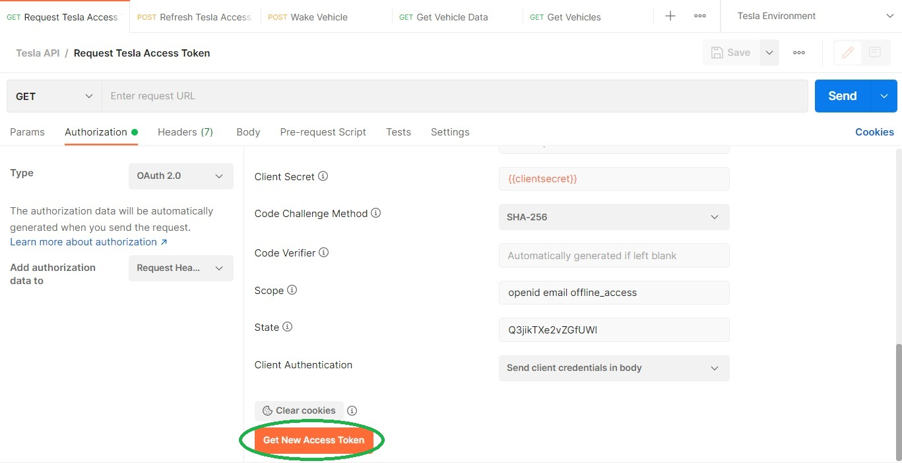
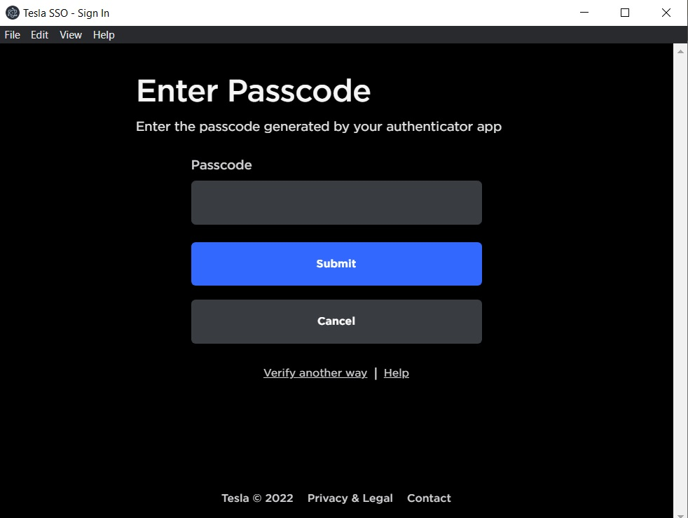

# Using the Tesla API with Desktop Version of Postman

**PLEASE READ STEPS DOCUMENTATION BEFORE ATTEMPTING AUTHENTICATION.**  Familarity with [Postman](https://www.postman.com/) is recommended. Postman has encapsulated the OAuth 2.0 sequence reducing the number of steps from the previous release of this collection.

It is not necessary to store your credentials in Postman.  Postman presents the Tesla authentication web page from Tesla's website in an embedded browser to generate the access token.

Thanks to Eric Schnabel for the first update that included this method, thanks to Postman for this [reference](https://documenter.getpostman.com/view/5857899/TW74k5k4), and thanks to tesla-info for this [reference](https://tesla-info.com/tesla-token.php)!

**Note: This collection does not function as described on the web version of Postman.**

### Step 1: Request Tesla Access Token

USER PREPARATION: Enter the client secret in the environment. The current client secret is [available here](https://pastebin.com/pS7Z6yyP).  The client ID is not needed.  Save these changes before requesting a token.

#### Documentation

Navigate to the Authorization tab of the "Request Tesla Access Token" call.  Scroll to the bottom and click on "Get New Access Token" .  Postman presents the Tesla authentication web page from the Tesla website.  Enter your credentials.  If MFA is enabled, it will request a code.

##### Log In Sequence

The Tesla Log In Sequence collects your email, password, and MFA code (if enabled).

##### Email

##### Password

##### MFA (if enabled)

When the authtication completes, the access token and refresh token are placed into the Token Manager 

and named with the most recent date and time .

To use the tokens, they must be copied and pasted into the environment.  Presently, this is a manual task; Postman may provide some automation in the future.  Carefully copy the access token to the access_token environment variable, and copy the refresh token to the refresh_token environment variable.

Note the access token is valid for eight hours.

### Step 2: Refresh Tesla Access Token

#### Documentation

The purpose of this step is refresh the access token, update the requestState environment variable, and to initialize an environment variable that contains the expiration date and time (readableValidUntilDate).  The value of readableValidUntilDate is presented in the Console to show the expiration date and time of the access token.  You DO NOT have to wait for an access token to expire before using Refresh Tesla Access Token.

Click on Send to refresh the access token.  Note that the refresh token is valid for 60 days.  After the refresh token expires, it is necessary to use Request Tesla Access Token to create valid access and refresh tokens (I have not validated the 60 day claim).

### API Calls

#### Get Vehicles

NOTE: Use Get Vehicles first.

The Get Vehicles call retrieves a list of vehicles on your Tesla account.  It extracts the id_s variable for the first vehicle and stores it in the teslaVehicleIdS environment variable.  Without this value, other API calls will fail.  Once id_s has been retrieved, Get Vehicles is not needed for the API calls.

#### Wake Vehicle

The Wake Vehicle call wakes a sleeping vehicle.  A vehicle must be online to respond to requests for vehicle information.

The Tests contains a check named Vehicle On-Line Check.  If the test passes, the vehicle is online.  The access token expiration date and time appear in the Console.

#### Get Vehicle Data

The Get Vehicle Data call retrieves all available data for the vehicle defined by the teslaVehicleIdS environment variable.

#### Get Drive State

The Get Drive State call retrieves drive state data (location, power, shift state, and other data) for the vehicle defined by the teslaVehicleIdS environment variable.

#### Get Charge State

The Get Charge State call retrieves charge state data (battery level, charging information, and other data) for the vehicle defined by the teslaVehicleIdS environment variable.
